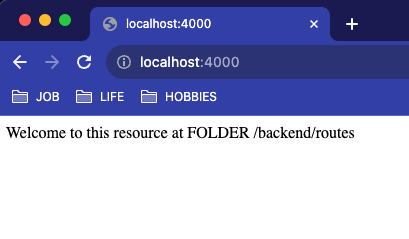
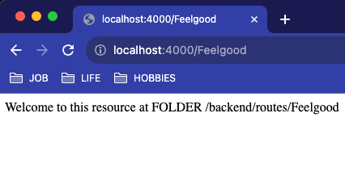

# Maze-Autoroute &#128739;

Mapping your routes by a folder structure.

This document serves as a briefing for the npm package I published [here](https://www.npmjs.com/package/maze-autoroute). It provides you with enough documentation to help set up a demo showcasing how the maze-autoroute works. However, all the detailed technical information is available in on [NPM](https://www.npmjs.com/package/maze-autoroute).


Go check the documentation to complete this one with more details.

## Don't waste time anymore on creating new routes!

#### Without an Autoroute 
<i>On a bad day</i>, with the need of creating a new project with routing you have to do following steps :

0. <b>Create your server minimal code.</b>
1. Create your variable to store the new route.
1. Import the custom route module.
1. Edit the server file in the right place to make the new route available.
1. <b>Create the module Folder and its index.js exporting a router.</b>
1. <b>Define your route(s) into the new index.js module.</b>
1. Test if everything is working (you may have made some mistakes in the previous steps - like typos).
1. Make potential corrections.
1. Breath.

#### With an Autoroute
<i>Still on a bad day, on a rush, tired, or whatever</i> :

0. <b>Create your server minimal code.</b>
1. <b>Create a Folder tree containing your modules exporting a router.</b>
2. Breath.

## Getting started
You will clone this already made project so you can have a feel to it in no effort or so.

Open a terminal in an *empty folder*, and clone the repo :
```sh
$ git clone https://github.com/ManuUseGitHub/mz-express-autoroute-demo.git .
```
NOTE: 
White the dot "`.`" at the end of the command, the content of the repository will be copied and not the containing folder.

Then install dependencies
```sh
$ npm i
```

Then run the server in watch mode.

```sh
$ npm run watch-server
```
This command will rerun the server each time you change the server or an endpoint. Via this command you can notice that you can create/delete/rename(folder of) endpoints on the fly and the server will adapt! Magic!

OR if you want it to stay calm, just run this command:
```sh
$ npm run server
```

## Time to play!

1. Delete eveything that is in `/backend/routes`.
2. Create an `index.js` file. Then copy this code into it.

```js
const express = require("express");
const router = express.Router();

router.get('/', async (req, res) => {
    res.send(`Welcome to this resource at FOLDER ${__dirname.replace(process.cwd(),"")}`);
})

router.get('/greet/name/:something', async (req, res) => {
    res.send(`Please to meet you ${req.params.something} ! I'm an endpoint defined at FOLDER ${__dirname.replace(process.cwd(),"")}`);
})

module.exports = router;
```
3. run the server if it is not already running in watch mode
```sh
$ npm run watch-server
# OR
$ npm run server
```
4. Open your browser at [localhost:4000](http://localhost:4000)

Here is what you can see


5. Copy the same file, but the copy into a new folder `/backend/routes/Feelgood` , save and once done (rerun the server if stopped), go to the browser at corresponding address ([localhost:4000/Feelgood](http://localhost:4000/Feelgood)). You should see this :

.

6. Enjoy !

## Options

You can find the options in the server.js. There is a preset. Just check these lines of code.
```js
// ROUTES ----------------------------------------------------------
const onmatch = ({ route, module }) => app.use(route, require(module));

const options = {
    onmatch,
    verbose: true,
    rootp: "/backend/routes",
    subr: "b64",
    translations: [{ from: "helloworld/hope/word", to: "worldhello" }],
    flat: true
}

const autoroute = new Autoroute();
autoroute.getMapping(options);
// END ROUTES ------------------------------------------------------
```

To better understand how you can tune the autorouter, take a look at the documentation 😀 !
It is available on [NPM : maze-autoroute](https://www.npmjs.com/package/maze-autoroute) and on [GitHub : maze-autoroute](https://github.com/ManuUseGitHub/Maze-Autoroute).